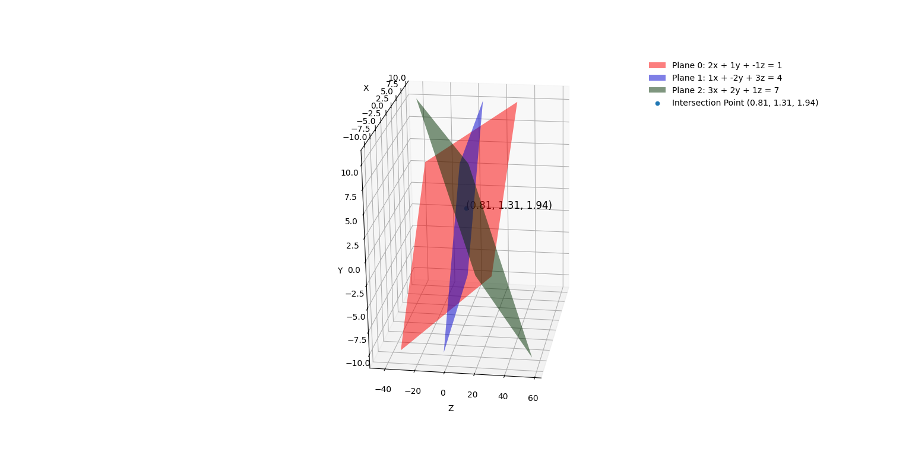

# 📈 Cramer's rule applied to system visualized

This project demonstrates Cramer's Rule in a **3D coordinate system**. Using Matplotlib, this project plots three planes in 3D space, showing how they intersect at a single point, effectively visualizing the solution to a linear system of three equations.
## ✨ Features:
- 3D Visualization: Plots three planes using different colors for clear differentiation.
- Equation Labels: Each plane is clearly labeled with its equation in the format:

$$
Plane : ax + by + cz = d
$$

- Intersection Highlighting: Marks and labels the exact point where the planes intersect.
- Dynamic Input: Reads system coefficients from a CSV file (input.csv) for flexible testing of different systems.

## 🎯 Future Improvements:
 - Highlighting the lines where each pair of planes intersects.
 - Adding support for dynamic input and better error handling.

## Diagrams:
| Image of the plot            | 
|-----------------------------|
|  |
| |

## Install - using Git
1. Clone the repository:
   ```bash
   git clone https://github.com/BogdanVlad06/cramer-system-visualized.git

2. To setup virtual environment:
   ```bash
   python -m venv venv
   venv\Scripts\activate
3. Install dependencies:
   ```bash
   pip install -r requirements.txt
